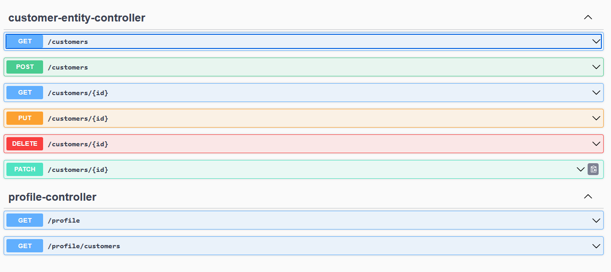
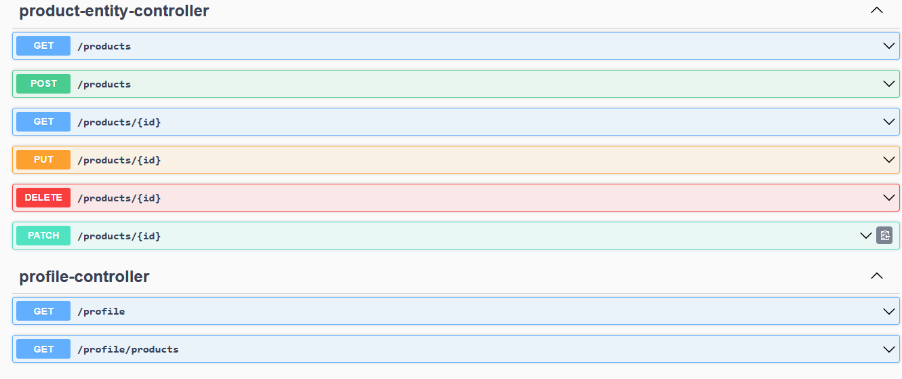

# Architecture de Microservices

## Vue d'ensemble

Ce projet implémente une architecture complète de microservices utilisant Spring Boot et Spring Cloud. L'architecture comprend plusieurs services indépendants qui communiquent entre eux via des appels HTTP, avec une gestion centralisée de la configuration et une découverte de services automatique.

### Stack Technologique

- **Framework Principal** : Spring Boot 3.5.6
- **Gestion Cloud** : Spring Cloud 2025.0.0
- **Base de Données** : H2 (Base de données en mémoire)
- **Java** : Version 17
- **Build Tool** : Maven

---

## Architecture Générale

### Diagramme des client Eureka


Cette image illustre les services client  enregistrés dans le serveur Eureka.

---

## Services Disponibles

### 1. Discovery Service (Service de Découverte)

**Port** : 8761  
**Type** : Service de Découverte Eureka  
**Description** : Service de registre centralisé qui permet à tous les microservices de se découvrir automatiquement.

#### Fonctionnalités
- Registre de service automatique
- Découverte dynamique des microservices
- Health check des instances

#### Configuration
```properties
eureka.instance.prefer-ip-address=true
management.endpoints.web.exposure.include=*
```

#### Accès
- URL : http://localhost:8761/
- Dashboard Eureka disponible

---

### 2. Config Service (Service de Configuration Centralisée)

**Port** : 8888  
**Type** : Config Server  
**Description** : Serveur de configuration centralisé qui fournit les configurations à tous les autres microservices.

#### Fonctionnalités
- Gestion centralisée de la configuration
- Support du contrôle de version
- Refresh dynamique de la configuration (avec `@RefreshScope`)

#### Configuration Centralisée
Les configurations sont stockées dans le dossier `config-repository/` :
- `application.properties` : Configuration globale
- `billing-service.properties` : Configuration spécifique au service de facturation
- `customer-service.properties` : Configuration spécifique au service client
- `inventory-service.properties` : Configuration spécifique au service d'inventaire

---

### 3. Customer Service (Service Client)

**Port** : 8081  
**Type** : Microservice  
**Description** : Service responsable de la gestion des clients.

#### Fonctionnalités
- Gestion des profils clients
- CRUD complet pour les entités clients
- Base de données H2 locale (`customerdb`)

#### Base de Données
- URL : `jdbc:h2:mem:customerdb`
- Console H2 activée

#### Endpoints API



Cette image détaille les endpoints disponibles pour le service client.

#### Dépendances Principales
- Spring Data JPA
- Spring Data REST
- Spring Web
- Spring Cloud Config Client
- Spring Cloud Netflix Eureka Client

---

### 4. Inventory Service (Service d'Inventaire)

**Port** : 8082  
**Type** : Microservice  
**Description** : Service responsable de la gestion de l'inventaire et des produits.

#### Fonctionnalités
- Gestion des produits
- Suivi des stocks
- Gestion des niveaux d'inventaire
- Base de données H2 locale (`inventorydb`)

#### Base de Données
- URL : `jdbc:h2:mem:inventorydb`
- Console H2 activée

#### Endpoints API



Cette image détaille les endpoints disponibles pour le service d'inventaire.

#### Dépendances Principales
- Spring Data JPA
- Spring Data REST
- Spring Web
- Spring Cloud Config Client
- Spring Cloud Netflix Eureka Client

---

### 5. Billing Service (Service de Facturation)

**Port** : 8083  
**Type** : Microservice  
**Description** : Service responsable de la gestion de la facturation et des transactions.

#### Fonctionnalités
- Création et gestion des factures
- Suivi des transactions
- Calcul des montants facturés
- Base de données H2 locale (`billingdb`)

#### Base de Données
- URL : `jdbc:h2:mem:billingdb`
- Console H2 activée

#### Dépendances Principales
- Spring Data JPA
- Spring Data REST
- Spring Web
- Spring Cloud Config Client
- Spring Cloud Netflix Eureka Client

---

### 6. Gateway Service (Service de Passerelle)

**Port** : 8080  
**Type** : API Gateway  
**Description** : Point d'entrée unique pour toutes les requêtes API vers les microservices.

#### Fonctionnalités
- Routage des requêtes vers les services appropriés
- Équilibrage de charge
- Filtrage et transformation des requêtes

#### Configuration
- Format : YAML (`applicatio.yaml`)
- Routage dynamique vers les services Eureka

---

## Guide de Configuration

### Configuration Globale

Fichier : `config-repository/application.properties`

```properties
spring.h2.console.enabled=true
eureka.client.service-url.defaultZone=http://localhost:8761/eureka/
eureka.instance.prefer-ip-address=true
management.endpoints.web.exposure.include=*
```

### Configuration par Service

Chaque service a sa propre configuration spécifique :

#### Billing Service
```properties
spring.datasource.url=jdbc:h2:mem:billingdb
```

#### Customer Service
```properties
spring.datasource.url=jdbc:h2:mem:customerdb
```

#### Inventory Service
```properties
spring.datasource.url=jdbc:h2:mem:inventorydb
```

---

## Guide de Démarrage

### Ordre de Démarrage Recommandé

1. **Discovery Service** (8761) - Démarrez d'abord
   ```bash
   cd discovery-service
   mvn spring-boot:run
   ```

2. **Config Service** (8888) - Démarrez en deuxième
   ```bash
   cd config-service
   mvn spring-boot:run
   ```

3. **Services Métier** - Démarrez dans n'importe quel ordre
   ```bash
   # Customer Service (8081)
   cd customer-service
   mvn spring-boot:run
   
   # Inventory Service (8082)
   cd inventory-service
   mvn spring-boot:run
   
   # Billing Service (8083)
   cd billing-service
   mvn spring-boot:run
   ```

4. **Gateway Service** (8080) - Démarrez en dernier
   ```bash
   cd gateway-service
   mvn spring-boot:run
   ```

---

## Accès aux Services

### Dashboards et Consoles

| Service | URL | Description |
|---------|-----|-------------|
| Eureka Dashboard | http://localhost:8761/ | Registre des services |
| Config Server | http://localhost:8888/ | Configuration centralisée |
| Gateway | http://localhost:8080/ | Point d'entrée API |
| H2 Console (Customer) | http://localhost:8081/h2-console | Base de données client |
| H2 Console (Inventory) | http://localhost:8082/h2-console | Base de données inventaire |
| H2 Console (Billing) | http://localhost:8083/h2-console | Base de données facturation |

### Endpoints API Principaux

#### Via Gateway (Recommandé)
```
GET  /customer-service/api/customers
POST /customer-service/api/customers
GET  /inventory-service/api/products
POST /inventory-service/api/products
GET  /billing-service/api/invoices
POST /billing-service/api/invoices
```

#### Directement sur les Services
```
Customer:   http://localhost:8081/api/customers
Inventory:  http://localhost:8082/api/products
Billing:    http://localhost:8083/api/invoices
```

---

## Structure du Projet

```
microservices-architectures/
├── discovery-service/          # Service Eureka
├── config-service/             # Config Server
├── config-repository/          # Repository de configuration centralisée
├── customer-service/           # Service de gestion des clients
├── inventory-service/          # Service de gestion de l'inventaire
├── billing-service/            # Service de facturation
├── gateway-service/            # API Gateway
└── images/                     # Images d'architecture et documentation
    ├── services-eureka.png
    ├── API-customer-service.png
    └── API-inventory-service.png
```

---

## Communication entre Services

### Architecture de Communication

L'architecture utilise le modèle suivant :

1. **Client** → **API Gateway** (Port 8080)
2. **API Gateway** → **Services Métier** (via découverte Eureka)
3. **Services Métier** ↔ **Services Métier** (communication directe via Eureka)
4. Tous les services → **Config Server** (pour la configuration)
5. Tous les services → **Discovery Service** (pour s'enregistrer et découvrir)

### Pattern de Service à Service

Les microservices utilisent RestTemplate ou Feign Client pour communiquer entre eux :

```
Service Client → Service Facturation → Service d'Inventaire
```

---

## Gestion des Données

### Base de Données par Service

Chaque service maintient sa propre base de données H2 en mémoire :

- **Customer Service** : `customerdb` - Données des clients
- **Inventory Service** : `inventorydb` - Données des produits et stocks
- **Billing Service** : `billingdb` - Données des factures et transactions

### Avantages

-  Isolement des données
-  Scalabilité indépendante
-  Pas de dépendances directes aux données
-  Communication via APIs

---

## Résilience et Monitoring

### Fonctionnalités Intégrées

- **Health Checks** : Tous les endpoints exposent `/actuator/health`
- **Metrics** : Disponibles via `/actuator/metrics`
- **Service Discovery** : Gestion automatique de la disponibilité
- **Configuration Centralisée** : Facilite la gestion des changements

### Endpoints Actuator

Tous les services exposent les endpoints Actuator :
```
GET /actuator
GET /actuator/health
GET /actuator/metrics
GET /actuator/env
```

---

## Technologies et Dépendances

### Spring Cloud

- **Eureka Client** : Découverte de services
- **Config Client** : Client de configuration centralisée
- **Cloud Gateway** : Routage intelligent

### Spring Boot

- **Spring Web** : API REST
- **Spring Data JPA** : Accès aux données
- **Spring Data REST** : Exposition automatique des endpoints

### Autre

- **H2 Database** : Base de données légère
- **Maven** : Gestion des dépendances et build

---

## Conseils de Développement

### Pour Ajouter un Nouveau Service

1. Créez un nouveau répertoire pour le service
2. Générez un projet Spring Boot avec Maven
3. Ajoutez les dépendances :
   - spring-cloud-starter-config
   - spring-cloud-starter-netflix-eureka-client
   - spring-boot-starter-web
   - spring-boot-starter-data-jpa
4. Configurez `application.yml` avec le nom du service
5. Enregistrez la configuration dans `config-repository`

### Bonnes Pratiques

-  Utilisez toujours l'API Gateway pour accéder aux services
-  Maintenez les services sans état (stateless)
-  Utilisez des identifiants uniques pour tracker les requêtes
-  Implémentez le retry et le circuit breaker
-  Loggez les erreurs et les transactions importantes
-  Tester chaque service indépendamment

---

## Troubleshooting

### Service ne s'enregistre pas dans Eureka

1. Vérifiez que Eureka Server est en cours d'exécution
2. Vérifiez la URL Eureka dans la configuration
3. Vérifiez les logs pour voir les erreurs de connexion

### Configuration non mise à jour

1. Vérifiez que le Config Server est en cours d'exécution
2. Utilisez le endpoint `/actuator/refresh` pour recharger la configuration
3. Vérifiez les fichiers de configuration dans `config-repository`

### Erreurs de Communication entre Services

1. Vérifiez que tous les services sont enregistrés dans Eureka
2. Vérifiez la connectivité réseau
3. Vérifiez que l'API Gateway fonctionne correctement

---

## Documentation des Images

### services-eureka.png
Cette image illustre  les services enregistrés comme client au server Eureka.

### API-customer-service.png
Détails des endpoints REST disponibles du Customer Service pour la gestion des clients (GET, POST, PUT, DELETE).

### API-inventory-service.png
Détails des endpoints REST disponibles de l'Inventory Service pour la gestion des produits et de l'inventaire.

---

## Versions et Compatibilité

| Composant | Version |
|-----------|---------|
| Java | 17 |
| Spring Boot | 3.5.6 |
| Spring Cloud | 2025.0.0 |
| Maven | 3.6+ |

---

## Support et Maintenance

Pour toute question ou problème :

1. Consultez les logs des services
2. Vérifiez le statut dans Eureka Dashboard
3. Vérifiez la configuration dans Config Server
4. Testez les endpoints individuels

---

## Prochaines Étapes

Pour améliorer cette architecture :

1. Ajouter des tests d'intégration
2. Implémenter le monitoring avec ELK ou Prometheus
3. Ajouter le circuit breaker avec Resilience4j
4. Configurer la sécurité avec Spring Security et OAuth2
5. Implémenter le message broker (RabbitMQ, Kafka)
6. Ajouter la documentation OpenAPI/Swagger

---


